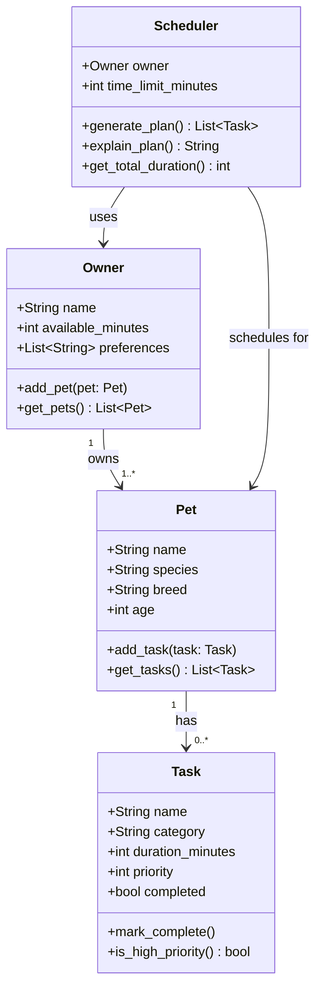

# PawPal+ UML Class Diagram

```mermaid
classDiagram
    class Owner {
        +String name
        +int available_minutes
        +List~String~ preferences
        +add_pet(pet: Pet)
        +get_pets() List~Pet~
    }

    class Pet {
        +String name
        +String species
        +String breed
        +int age
        +add_task(task: Task)
        +get_tasks() List~Task~
    }

    class Task {
        +String name
        +String category
        +int duration_minutes
        +int priority
        +bool completed
        +mark_complete()
        +is_high_priority() bool
    }

    class Scheduler {
        +Owner owner
        +int time_limit_minutes
        +generate_plan() List~Task~
        +explain_plan() String
        +get_total_duration() int
    }

    Owner "1" --> "1..*" Pet : owns
    Pet "1" --> "0..*" Task : has
    Scheduler --> Owner : uses
    Scheduler --> Pet : schedules for
```
